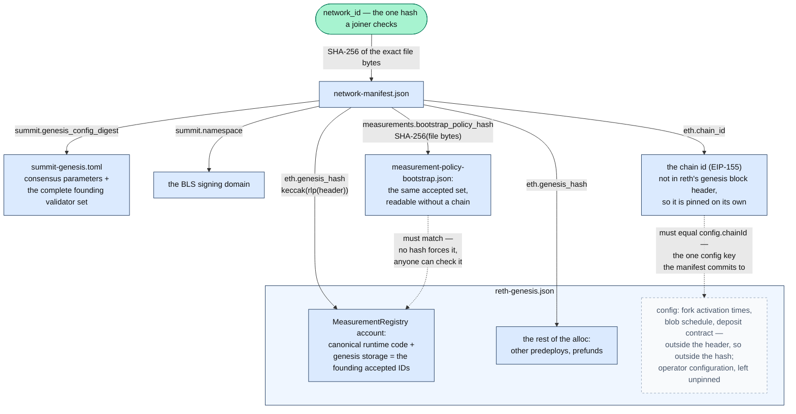
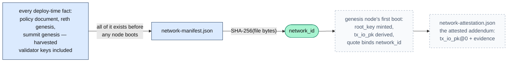

# The Network Manifest <!-- omit in toc -->

**Status**: the manifest is shipped and in use (enclave
[#190](https://github.com/SeismicSystems/enclave/pull/190),
[#194](https://github.com/SeismicSystems/enclave/pull/194)), proven in the
four-node founding. The attested addendum is specified design, not yet built;
its section says so again where it starts.

What identifies a Seismic network. `network-manifest.json` is the deploy-time
artifact a network is named by: `network_id = SHA-256(exact file bytes)`, bound
into every attestation transcript so evidence minted on one network can never
verify on another.



This doc is the field-by-field reference. The implementation is the
[`seismic-network-manifest`](https://github.com/SeismicSystems/enclave/tree/seismic/crates/network-manifest)
crate — strict parser, `NetworkId` derivation, and the golden fixture every
stack pins — and the two must agree at all times. A network ships one more
artifact, the attested addendum, but it is not a second half of the identity:
it carries the network's TEE-born key state, it names `network_id` rather than
contributing to it, and it rotates on disaster recovery while `network_id`
never does.

- [Summary](#summary)
- [What the manifest is not](#what-the-manifest-is-not)
- [The v1 fields](#the-v1-fields)
- [`network_id` = SHA-256 of the exact bytes](#network_id--sha-256-of-the-exact-bytes)
- [Validation gates](#validation-gates)
- [Consumers of `network_id`](#consumers-of-network_id)
- [Lifecycle](#lifecycle)
- [What the manifest cannot hold](#what-the-manifest-cannot-hold)
- [The attested addendum](#the-attested-addendum)
- [Design rationale](#design-rationale)


## Summary

- **The artifact is the identity.** `network_id` is the SHA-256 of the file's
  bytes, exactly as `sha256sum` computes it. Any holder of the bytes derives the
  id with no schema, no parser, and no canonical-JSON spec to reimplement.
- **It is what a joiner can check before it can check anything else.** Reading
  Seismic state at all requires `root_key`, which is exactly what a joining node
  is asking for, so the manifest is its only pre-chain anchor.
- **One hash reaches every founding artifact.** The reth genesis (and through it
  the registry's initial policy storage), the complete summit genesis, and the
  bootstrap measurement policy are all reachable from the manifest's fields.
  Each field commits to an exact scope, stated in
  [Validation gates](#validation-gates).
- **Deploy-time facts only.** Everything in the manifest can be computed before
  any node boots, because `network_id` must exist before the first node mints
  its first quote. Facts born inside the genesis TEE live in a second,
  separately attested artifact.
- **Immutable for the network's lifetime.** The manifest is written once, by one
  emitter, and travels as opaque bytes to every consumer. Nothing ever
  re-renders it.
- **It pins founding values; a live value can move elsewhere.** The measurement
  set in force today is registry state on chain, and the manifest freezes what
  the network founded on. That split — a frozen commitment in the file, a live
  value moved by on-chain authority — is the shape a network-defining value
  takes when it has to change without changing `network_id`.

## What the manifest is not

Who *does* use the manifest, and for what, is
[Consumers of `network_id`](#consumers-of-network_id). Deliberately, it is not:

- **the responder's admission policy.** A responder verifies a joiner against
  `MeasurementRegistry.isAccepted()` on its own reth. There is no
  local-artifact policy path on the responder at all — see
  [chain-backed admission](chain-backed-admission.md).
- **peer discovery or per-node config.** Bootnodes, domain names, and IPs ride
  in the per-boot config POST, outside the manifest.
- **a mutable registry.** Post-genesis measurement changes are authority
  transactions against the registry contract.

## The v1 fields

```json
{
  "eth": {
    "chain_id": 5124,
    "genesis_hash": "0x78ab9057bb67f95a6182969c5d755ac02802c98c0d2f0d8daeb52f4bddc60be5"
  },
  "manifest_version": 1,
  "measurements": {
    "bootstrap_policy_hash": "0xcccccccccccccccccccccccccccccccccccccccccccccccccccccccccccccccc",
    "contracts": {
      "authority": "0x1000000000000000000000000000000000000002",
      "registry": "0x1000000000000000000000000000000000000001"
    }
  },
  "name": "seismic-devnet-3",
  "summit": {
    "genesis_config_digest": "0xbbbbbbbbbbbbbbbbbbbbbbbbbbbbbbbbbbbbbbbbbbbbbbbbbbbbbbbbbbbbbbbb",
    "namespace": "seismic-devnet-3"
  }
}
```

The artifact carries nothing but its fields. JSON cannot carry comments, so the
hashed bytes are semantic-only by format rather than by discipline. The
documentation is this table.

| field                                | type        | meaning and constraints                                                                                                                                                                                                                                                                                                                                                                                                                                                                        |
| ------------------------------------ | ----------- | ---------------------------------------------------------------------------------------------------------------------------------------------------------------------------------------------------------------------------------------------------------------------------------------------------------------------------------------------------------------------------------------------------------------------------------------------------------------------------------------------- |
| `manifest_version`                   | int         | Schema version of this document; `1`.                                                                                                                                                                                                                                                                                                                                                                                                                                                          |
| `name`                               | string      | Human label. Intentionally part of the hash: the stated intent is part of the identity.                                                                                                                                                                                                                                                                                                                                                                                                        |
| `eth.chain_id`                       | int         | Must equal `config.chainId` inside the reth genesis JSON. Not derivable from `eth.genesis_hash` — the genesis hash covers the header, and `config` lives outside it — so the chain id is an independent commitment. Separates transaction replay (EIP-155).                                                                                                                                                                                                                                    |
| `eth.genesis_hash`                   | 32-byte hex | `keccak(rlp(header(reth-genesis.json)))`, computed offline by `seismic-reth genesis-hash` down the same parse path a booting node takes. Commits to the full genesis alloc: the registry's runtime code and initial policy storage, the other predeploys, prefunds. Does not commit to the file's `config` section — see [Validation gates](#validation-gates).                                                                                                                                        |
| `summit.genesis_config_digest`       | 32-byte hex | Summit's own `config_digest` over the complete `summit-genesis.toml`: SHA-256 over its domain-prefixed SSZ, computed offline by `summit genesis digest`. Covers the consensus parameters and, per validator, both pubkeys and the withdrawal credentials; excludes `ip_address`, which is topology rather than identity. The same value domain-separates every consensus signature, so live nodes already enforce agreement on everything it covers ([network founding](network-founding.md)). |
| `summit.namespace`                   | string      | The BLS signature domain separator. Must equal the genesis file's value; duplicated here so a verifier need not parse TOML. Distinct namespaces are what stop a validator key active on two chains from producing votes valid on both.                                                                                                                                                                                                                                                         |
| `measurements.bootstrap_policy_hash` | 32-byte hex | SHA-256 of the bootstrap policy document's bytes — the founding accepted measurement set, promoted from seismic-images' `make measure` output. The document format is the [attestation crate's](https://github.com/SeismicSystems/attested-tls/blob/main/crates/attestation/README.md) list of per-image measurement records, one file covering every attestation type.                                                                                                                        |
| `measurements.contracts.registry`    | address     | The measurement registry, duplicated from the genesis alloc for verifiers that do not hold the genesis file. Grouping it under `measurements` is deliberate: this contract's storage and the bootstrap document are two representations of one measurement set.                                                                                                                                                                                                                                |
| `measurements.contracts.authority`   | address     | The authority allowed to mutate the registry.                                                                                                                                                                                                                                                                                                                                                                                                                                                  |

Both contract fields are named by role, not by contract class, so a contract
rename never touches the hashed schema. Today the roles are filled by
[`MeasurementRegistry.sol`](../../contracts/src/enclave/MeasurementRegistry.sol)
and
[`MeasurementAuthorityDev.sol`](../../contracts/src/enclave/MeasurementAuthorityDev.sol),
predeployed at the addresses above.

**Strictness.** A v1 parser rejects unknown keys; new fields mean
`manifest_version = 2` and a new type. The version is probed before the strict
parse, so a future-version file reports "unsupported manifest_version 2" rather
than a confusing unknown-field error. Strict parsing is about two verifiers
agreeing on *semantics* — the hash is over raw bytes, so an unknown field could
never silently change `network_id`.

**File profile.** UTF-8, no BOM, LF endings, integers only, lowercase
`0x`-prefixed hex, no duplicate keys. These are authoring rules, not
verification rules: the hash covers whatever bytes are published. The deploy
tool is the sole emitter — through the enclave repo's `seismic-manifest
render`, built on the schema crate every node parses with, so emitter and
parser cannot disagree — and renders deterministically: 2-space indent, key-sorted,
single trailing newline. The file is never hand-typed. It is emitted into a
committed
[network directory](https://github.com/SeismicSystems/deploy/blob/main/tee/networks/README.md)
holding the artifacts it pins, whose
[provenance diagram](https://github.com/SeismicSystems/deploy/blob/main/tee/networks/network-dir.svg)
traces where each one came from.

## `network_id` = SHA-256 of the exact bytes

```text
network_id = SHA-256(exact bytes of network-manifest.json)
```

Equivalently `sha256sum network-manifest.json`. Presentation form is lowercase
0x-hex; transcript form is the raw 32 bytes.

The hash covers raw bytes, not a canonical encoding of the content. A copy that
gains a trailing newline is therefore a different network, and that is the
intended failure: the edited copy's id matches nothing, POST-time validation
rejects it, the handshake binding check rejects it, no secret moves first, and
the diagnosis is `sha256sum` on both sides. A canonical encoding would forgive
the cosmetic edit, at the price of a transform that must stay bit-identical
across Rust, Python, and TypeScript
([Design rationale](#design-rationale)).

The cost is that the bytes must survive transport unmodified, which is a rule
rather than a hope:

> **Byte-exactness rule.** The manifest travels as opaque bytes through every
> hop. It rides in the config POST's `[network]` section as a base64 field —
> base64 makes the opacity explicit and sidesteps TOML string-escaping
> subtleties — and `configure` merges it in from the network's manifest file
> rather than embedding it in an authored config. tdx-init writes the decoded
> bytes verbatim to `/run/seismic/conf/network-manifest.json` and never
> parses-and-re-serializes. Consumers hash the bytes they read, where they read
> them; nobody trusts a precomputed id handed to them.

Two corollaries:

- **Nothing non-semantic lives in the artifact.** Everything in the file is
  identity, so the file holds only fields. The one remaining degree of freedom
  is whitespace, fixed by the single deterministic emitter.
- **Mismatches must be cheap to diagnose.** Every tool that computes
  `network_id` — the deploy tool, tdx-init, the attestation service — prints
  it, and every mismatch error shows expected against computed, so the first
  debugging step is always comparing two `sha256sum` lines.

There is no domain-separation prefix inside the file hash. Domain separation
lives in the transcript context strings that consume `network_id`, and plain
file hashing preserves the `sha256sum` property.

## Validation gates

Every commitment in the graph at the top is checked somewhere. Everything fails
at deploy, at POST time, or at the moment a verdict is given — never silently at
boot:

- **The deploy tool, at assembly.** `eth.chain_id` equals the genesis JSON's
  `config.chainId`; `eth.genesis_hash` equals the recomputed
  `seismic-reth genesis-hash`; `summit.genesis_config_digest` equals the
  recomputed `summit genesis digest`; the summit genesis's own embedded
  `eth_genesis_hash` and `namespace` match the manifest's; the policy hash
  matches the document bytes; both contract addresses exist in the alloc with
  code; and the registry account holds the canonical runtime code plus exactly
  the storage the policy document compiles to — every expected slot present,
  no unexplained slot. That last one is the only check here whose result no
  hash carries forward, so it stays recomputable from the pinned bytes by
  anyone, and nothing rests on deploy having run it. The tool then re-parses
  its own emitted bytes through the same strict schema a consumer applies, so a
  bad manifest never leaves it.
- **tdx-init, at POST time.** Strict schema validation, plus the cross-artifact
  checks possible without reth's chain-spec parser and summit's SSZ: the
  embedded reth genesis is valid JSON whose `config.chainId` matches
  `eth.chain_id`, and the embedded summit genesis is valid TOML whose
  `namespace` matches `summit.namespace`. These are precisely the fields the
  manifest duplicates for the purpose. Hash-level recomputation stays on the
  deploy side, and `configure`'s launch assertion — every node's reth serves
  `eth.genesis_hash` as block 0 — checks the cohort from the operator's side.
- **The attestation service, at every admission decision.** The hash of block 0
  served by the node's own reth must equal `eth.genesis_hash`. This is the
  check that makes a registry read a read of *this* network's policy. The
  operator-side assertion above catches a misconfigured node but not a host
  that POSTs a genesis of its choosing, and every admission verdict rests on
  chain state the host supplies — so the binding has to be enforced inside the
  guest, at the point of use. Reth validating every state transition from that
  genesis does the rest: reaching a policy the network never authorized then
  needs the authority key, not an edited JSON file.

**What `eth.genesis_hash` covers, and what it does not.** The genesis hash
commits to the header. The genesis file's `config` section — fork activation
times, the blob schedule, the deposit contract address — lives outside the
header, so two genesis files differing only in a future-dated fork time hash
identically. The manifest deliberately leaves `config` unpinned: the fork
schedule is operator configuration, not a network-defining commitment
([Design rationale](#design-rationale)). Only `config.chainId` is committed,
through `eth.chain_id`. Keeping fork times in the config POST rather than in
the image is what lets one measured hardfork image serve devnet, testnet, and
mainnet on different clocks, and a hardfork changes no manifest field, so
`network_id` survives every fork.

## Consumers of `network_id`

**Transcript bindings.** Every attested exchange in the network binds
`network_id`, so a transcript from one network cannot verify on another — a
quote from the right image on the wrong fork fails here:

```text
tx_io_binding             = SHA256("seismic-tx-io-v1:"        || network_id || tx_io_pk || epoch_be64)
root_key_request_binding  = SHA256("seismic-root-key-req-v1:" || network_id || nonce_b || eph_pk_b)
root_key_response_binding = SHA256("seismic-root-key-resp-v1:"|| network_id || nonce_b || eph_pk_a || wrapped)
deploy_verification_binding  = SHA256("seismic-deploy-v1:"       || network_id || deployment_nonce)
```

Each digest is what a quote commits to: the guest minting the quote carries it
in the quote's `report_data`, and a verifier recomputes the binding from its
*own* `network_id` plus the fields the message claims, then compares. Nothing
the message asserts is trusted for that check.

The layout rule is enforced by the Rust signatures in
[`bindings.rs`](https://github.com/SeismicSystems/enclave/blob/seismic/crates/attestation/src/bindings.rs)
(`&NetworkId`, fixed-size nonces and compressed points, `u64` epochs, a `&[u8]`
tail only): domain string first, then fixed-length fields, at most one
variable-length field and only in tail position. That keeps plain concatenation
injective without length prefixes. A test pins each digest against an
independently computed vector. Both sides of the root-key handshake verify the
peer's binding against *their own* `network_id`, and a mismatch is a hard
reject.

The one attested exchange that cannot bind `network_id` is the founding harvest,
which happens before the manifest exists; it binds a deploy-supplied nonce
instead, and the pin itself provides the intent binding
([network founding](network-founding.md)).

**The attestation service** hashes `/run/seismic/conf/network-manifest.json` at
startup, refuses to serve without it, and uses the resulting `network_id` in
every binding: `getTxIoAttestationEvidence(epoch)` answers with
`tx_io_binding(network_id, tx_io_pk, epoch)`,
`getDeployVerificationEvidence(deployment_nonce)` answers with
`deploy_verification_binding(network_id, deployment_nonce)` — the caller
contributes only freshness — and `getWrappedRootKey` runs the request and
response bindings above. Two more manifest fields feed its
admission path: `measurements.contracts.registry`, the contract it asks for a
verdict, and `eth.genesis_hash`, the chain that contract has to live on.

**tdx-init** receives the manifest bytes in the config POST's `[network]`
section — common to genesis and joining nodes, since joiners need it just as
much — validates them, and writes them verbatim.

**Deploy verification and clients**: deploy tooling verifies a candidate
node's evidence against the manifest's pinned policy and `network_id` before
relying on it — publishing its address, or handing it to later nodes as a
bootnode. The check guards only those operator decisions; network membership
is granted by the attested root-key handshake and its admission policy, never
by this check. For a client, `network_id` is the pin answering "which network am I
encrypting this TxSeismic for". Carrying `(network_id, addendum)` in the chain
config, so a client can also validate a node's `tx_io` responses, is future work
that waits on [the addendum](#the-attested-addendum).

## Lifecycle

- **`network_id` is immutable for the network's lifetime** — across disaster
  recovery, across measurement-policy updates, across forks. The deploy tool
  refuses to overwrite an existing manifest for exactly this reason.
- **Policy updates are on-chain**, through the authority to the registry — the
  mechanism for changing any network-defining value after founding, since the
  file itself never changes. The manifest's pinned policy is the bootstrap
  policy only, and there is deliberately no manifest-refresh machinery. The
  staleness this implies is bounded and symmetric: a joiner verifying a
  responder's measurements against the manifest-pinned founding set will reject
  responders running images admitted later, and will keep accepting a founding
  image after governance has deprecated it, since deprecations are equally
  invisible off chain. [The addendum's](#the-attested-addendum) commitment check
  supersedes the joiner-side measurement check entirely — joiners verify the
  responder's transcript binding plus the delivered key against the pin, and
  drop the policy comparison. The deprecation half is the security reason to
  sequence that switch soon rather than eventually.
- **A new network gets a fresh manifest.** The freshly harvested founding keys
  alone guarantee a distinct `network_id`, since no two foundings can produce
  identical manifest bytes; in practice the name, namespace, and genesis differ
  too.

## What the manifest cannot hold

The manifest holds deploy-time facts only, which is why a second artifact exists
to hold the rest. The cut is not TEE-born versus authored — it is whether a fact
can exist *before* `network_id` must.



Everything left of the boot step above can exist pre-manifest, so that whole
prefix is the manifest. Summit's validator keys make the cut despite being
TEE-born: they are per-VM randomness with no boot-chain prerequisites, so
founding births them before the manifest, and the manifest pins the complete
summit genesis, validator set included
([network founding](network-founding.md)).

What cannot exist pre-manifest is anything derived from `root_key`. `root_key`
is network-shared, minted once, and distributed only through attested exchanges
whose transcripts bind `network_id` — its birth *requires* the manifest. Such
facts can only be attested afterwards, never pre-committed.

## The attested addendum

**Status**: specified here, not yet built.

`network-attestation.json` carries the network's TEE-born key state, attested
and bound to a `network_id` that already exists. It
is produced once, by the deploy tool, immediately after the genesis node's first
successful boot — a persisted snapshot of that node's `tx_io` attestation
evidence, whose quote binds `network_id`:

```json
{
  "addendum_version": 1,
  "network_id": "0x…",
  "created_at": "2026-06-11T00:00:00Z",
  "tx_io": { "pk": "0x02… 33-byte compressed secp256k1 …", "epoch": 0 },
  "evidence": { "… attestation exchange message …": "…" },
  "dcap_collateral": { "… PCK chain, TCB Info, QE Identity, CRLs …": "…" }
}
```

- **`tx_io.pk` at a pinned epoch is the `root_key` commitment.** It is a
  binding, deterministic function of `root_key` that is already published for
  TxSeismic clients, so no separate commitment construction is needed.
- **The addendum is self-authenticating against the manifest.** `evidence` is
  the genesis node's quote over `tx_io_binding(network_id, tx_io_pk, epoch)`, so
  a verifier checks the quote chain, checks the measurements against the
  manifest-pinned bootstrap policy, and checks the binding against the
  manifest's own `network_id`. A forged addendum fails one of the three.
- **It is not an input to `network_id`.** It ships alongside the manifest in the
  network's artifact set, under a distinct filename so no verifier can be
  confused about which bytes are hashed.

**Validity semantics: a birth certificate, not a live credential.** A quote
carries no expiry, but its verification chain does — Intel TCB Info, QE
Identity, and CRLs carry `nextUpdate` on a roughly 30-day cadence, and the
platform AK chain is ordinary X.509 with `notAfter`. So the addendum is verified
with validity-at-creation semantics: chains and TCB status are evaluated as of
`created_at`, never as of now. To make that possible offline the addendum must
be self-contained, which is what `dcap_collateral` is for — the DCAP collateral
current at creation, archived. The alternative is evaluating genesis-era
evidence against today's collateral, which is exactly the drift to avoid; the
verification entry points that take an explicit timestamp and explicit
collateral already exist, so this is supported usage rather than a fork.

Two things keep archived evidence from ever carrying trust on its own: the
joiner's load-bearing check is the commitment comparison rather than a quote
re-verification, and every live node re-attests the same pin under fresh
collateral each epoch. The residual risk is accepted: a later TCB recovery can
retroactively reveal that genesis-era firmware was vulnerable. "Valid at
genesis" means valid by what was knowable at genesis.

**How a joiner uses it.** After the root-key handshake decrypts `root_key`, the
joiner re-derives `tx_io_pk@0` and compares it against the addendum's pin. That
comparison is what makes the joiner's *measurement* check of the responder
non-load-bearing: the joiner holds no secrets yet, so a dishonest responder can
at worst deliver a wrong key, and the commitment check catches exactly that. The
handshake this sits inside is in
[chain-backed admission](chain-backed-admission.md).

**Recovery rotates the addendum, never `network_id`.** A recovered network
publishes a new addendum — a new `root_key`, so a new `tx_io_pk`, pinned at a
bumped epoch and attested by the recovery TEE — under the same `network_id`.
Clients and joiners must pick up the new pin, which makes recovery a
client-visible, auditable event.

## Design rationale

Alternatives weighed and set aside, with the reasons that decided them. Each
names the section whose rule it settles.

**Raw bytes rather than a canonical encoding** ([`network_id` = SHA-256 of the
exact bytes](#network_id--sha-256-of-the-exact-bytes)). The objection to byte
hashing is cosmetic divergence: a copy gains a trailing newline, and "the same"
manifest now has a different id. That scenario presupposes someone re-creating
the file, and nobody in the lifecycle does — the manifest is assembled exactly
once and copied as bytes through every hop. There is no independent
re-derivation path to protect. If a copy *is* edited, the two designs fail very
differently. Raw bytes fails loud and closed: the edited copy's id matches
nothing, every gate rejects it, and the diagnosis is one `sha256sum` per side. A
canonical encoding (JCS, deterministic CBOR) fails silent and open-ended: it
forgives the cosmetic edit, but the forgiveness costs a canonicalization
transform that must be bit-identical across Rust (the node side), Python (deploy
tooling), and eventually TypeScript clients. A divergence there — number
formatting, unicode edge cases — means two stacks compute different ids from the
same logical content, which is exactly the split-network bug `network_id` exists
to prevent, and it surfaces only on edge-case inputs, possibly long after
deployment. Brittle-but-loud beats forgiving-but-silently-divergent for a
security identifier. Byte hashing also makes the file an artifact, the way git
objects, container image digests, and the raw security policy Microsoft's
[Confidential Consortium Framework (CCF)](https://microsoft.github.io/CCF/)
pins in `host_data` are artifacts.

**JSON rather than TOML with inline comments** ([the v1
fields](#the-v1-fields)). TOML is attractive for an operator-reviewed artifact
that wants its rationale inline, and the surrounding config surface is TOML —
but comments are non-semantic bytes inside an identity hash, and both ways of
handling them lose. Hash them, and fixing a typo in a comment is a different
network, while prose invites churn on a file that must never change. Strip them
before hashing, and that is half a canonical form, with the multi-language
transform risk back again and no canonicalization standard to lean on. JSON's
inability to carry comments is the feature.

**The fork schedule stays out of the manifest** ([validation
gates](#validation-gates)) — no byte-pin of the reth genesis file, and no
amendment path for one. The test for whether a setting belongs in a
network-defining commitment is who a wrong value hurts. A wrong measurement
policy admits a bad image into the trust domain and hands it `root_key`: that
harms every user, so it is pinned and governed. A wrong fork time only harms
the node that set it. Block validity is checked by re-execution against the
header's state and receipts roots, so a node on the wrong side of a fork
computes different roots, rejects the cohort's blocks, and stalls; it cannot
make the honest majority accept a bad block, and it holds the same keys and
decrypts the same calldata it did before, so nothing leaks. That is the
guarantee every Ethereum hardfork has relied on, and TEEs change none of it.
Pinning would also have forced an amendment path — `network_id` survives forks,
so a pinned schedule needs an authority that can revise the pin without
re-issuing the manifest — for a setting that gains nothing from governance. The
lever for a setting that turns out to be dangerous is the measurement policy:
ship an image that no longer reads it, and deprecate the old one. Two costs are
accepted. There is no forkid-style early warning — summit has no devp2p peer
handshake, so a misconfigured validator boots cleanly and surfaces only at the
fork block, which deploy-side checks against the network's shipped genesis file
cover without touching the manifest. And no hardware receipt records which
schedule a node booted; extending a runtime measurement register with the
genesis bytes would add one, as auditability rather than as a correctness
mechanism.

**Two files rather than one document with a hashed subsection** ([the attested
addendum](#the-attested-addendum)) — the `tx_io` pin inside the file but outside
the hash. One file is operationally nice, but mixed hashed/unhashed sections
invite verifiers hashing the wrong scope, and the file would have to be mutated
post-genesis to insert the pin, which violates byte-exactness. Two files with
distinct names are unambiguous.

**Two files rather than a two-phase `network_id`** ([what the manifest cannot
hold](#what-the-manifest-cannot-hold)) — a draft id for the genesis boot, a
final one after. That gives two ids for one network: every transcript verifier
would need to know which phase it is in, and a hardware measurement of the
config would differ across the phases. Putting `tx_io_pk` in the manifest core
is the same problem stated forwards — impossible without a pre-boot key
ceremony, since `root_key` is born in the genesis TEE.

**SHA-256 rather than keccak256 for `network_id`** ([consumers of
`network_id`](#consumers-of-network_id)). The consumers are a SHA-256 world —
every `report_data` binding is SHA-256 — and `sha256sum` auditability wins. A
contract can store the value as `bytes32` either way.

**No joiner-side policy refresh** ([lifecycle](#lifecycle)) — fetching the
current policy instead of relying on the bootstrap pin, for instance by querying
the registry through a running node's RPC and feeding the result to tdx-init.
This is circular. Registry contents are chain state, and a joiner without
`root_key` cannot authenticate chain state — no trusted header, no readable
ledger — so "the current policy" is whatever an untrusted endpoint asserts, and
the joiner would be verifying its counterparty against a document that
counterparty's side could have chosen. The sound variant, complete policy
documents signed by manifest-pinned authority keys and accepted at any revision
above bootstrap, is the shape of
[The Update Framework (TUF)](https://theupdateframework.io/) and inherits
TUF's hard parts: rollback and freeze protection need freshness evidence,
which is chain state again.

**Precedent: CCF** ([the attested addendum](#the-attested-addendum)). The
manifest/addendum split follows CCF's: startup configuration is the trust
anchor, and the service certificate (`service_cert.pem`) is created when the
service opens and distributed out of band from then on — a credential the anchor
names, not a second anchor. The addendum's validity-at-creation semantics follow
CCF too — join quotes are verified once at admission and recorded, and nobody
re-verifies old quotes against live collateral — and so does recovery, where the
ledger continues, the service certificate rotates, and clients re-fetch.
